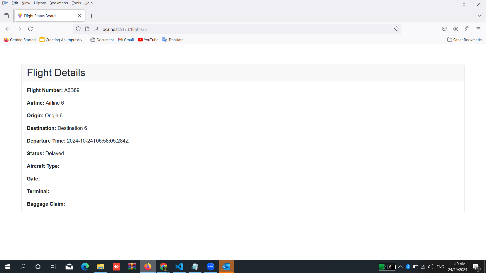

Project Overview

The Flight Status Tracker is a web application built using React and TypeScript that allows users to view real-time flight statuses. The application displays a table of flights
with information such as flight number, airline, origin, destination, and status. Users can click on a flight to view detailed information, including aircraft type, gate, terminal,
and baggage claim details.

Presentation Video
https://www.youtube.com/watch?v=G30TCPNXG28

## Installation

To run the application locally, follow these steps:

1. Clone the repository:
   git clone https://github.com/your-username/flight-status-app.git
   cd flight-status-app

2. Install the dependencies:
   npm install

3. Run the application:
   npm run dev

4. Build the application
   npm run build

Project Structure
The project consists of the following main directories and files:

flight-status-app/
│
├── public/
│ ├── index.html  
│ └── favicon.ico  
│
├── src/
│ ├── components/  
│ │ ├── Detail.tsx  
│ │ └── Table.tsx  
│ │
│ ├── services/  
│ │ └── api.ts  
│ │
│ ├── types/  
│ │ └── flight.ts  
│ │
│ ├── App.tsx  
│ ├── index.tsx  
│ ├── App.css  
│ └── index.css  
│
├── .gitignore  
├── package.json  
├── README.md  
└── tsconfig.json

components

Flight Table
Purpose
The Flight Table serves as the main interface for users to view and monitor the status of multiple flights in real-time. This feature is crucial for travelers, airport staff, and aviation enthusiasts as it consolidates essential flight information into a single, easily accessible format. By presenting flight data in a structured table, users can quickly gather the information they need regarding various flights, enhancing their ability to make informed decisions about their travel plans.

Features
Flight Number: Displays the unique identifier for each flight, allowing users to quickly reference their specific travel plans.
Airline: Shows the name of the airline operating each flight, helping users identify their service provider.
Origin: Indicates the departure location for each flight, providing context about the starting point of the journey.
Destination: Displays the arrival location, giving users insight into where the flight is headed.
Departure Time: Lists the scheduled departure time, essential for users to plan their arrival at the airport.
Status: Provides the current status of each flight (e.g., On Time, Delayed, Canceled), keeping users informed of any changes to their travel plans.
Details Button: Includes a button that navigates to the Flight Details page for more in-depth information about the selected flight.
 

Flight Details
Purpose
The Flight Details feature provides users with comprehensive information about specific flights. This is crucial for travelers, airport personnel, and anyone interested in monitoring flight statuses. By clicking on a flight from the status board, users can access real-time updates and specific details related to that flight, enhancing the user experience and providing valuable insights.

Features
Flight Number: Displays the unique identifier for the flight, helping users quickly reference their travel plans.
Airline: Shows the airline operating the flight, allowing users to identify their service provider.
Origin: Indicates the departure airport or city, giving context to the flight's journey.
Destination: Shows the arrival airport or city, helping users understand the flight's end point.
Departure Time: Provides the scheduled departure time, crucial for planning and timely arrivals at the airport.
Status: Displays the current status of the flight (e.g., On Time, Delayed, Canceled), keeping users informed of any changes.
Aircraft Type: Indicates the model of the aircraft, offering insights into the flight experience.
Gate: Shows the boarding gate assigned to the flight, essential for passengers navigating the airport.
Terminal: Provides information on the terminal from which the flight departs, aiding in airport navigation.
Baggage Claim: Indicates where passengers can collect their luggage upon arrival, streamlining the arrival process.
 

Conclusion
The Flight Status Application is a user-friendly interface for checking the status of flights. It utilizes React for the frontend, React Router for navigation, and Axios for API interactions. The application features:

A flight status board that displays a list of flights with their details.
A detailed view for each flight, showing specific information retrieved from the API.
Error handling and loading states to enhance user experience.
This project can be further enhanced by integrating more features such as user authentication, advanced filtering, and sorting of flights, or even incorporating WebSocket for real-time flight updates.
